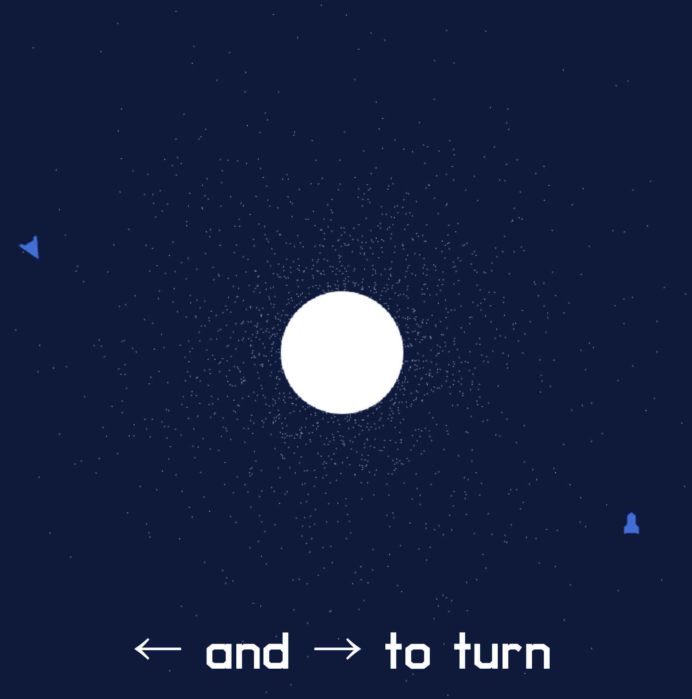
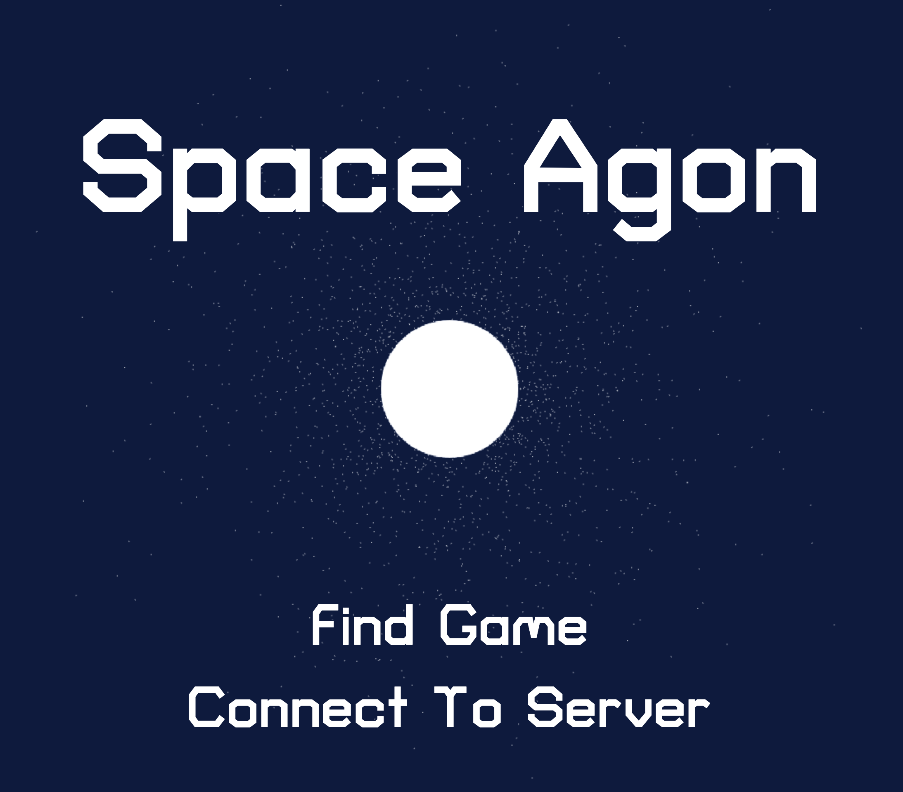

The original work is [Laremere/space-agon](https://github.com/Laremere/space-agon).

# Space Agon

Space Agon is a integrated demo of [Agones](https://agones.dev/) and
[Open Match](https://open-match.dev/).



## Before Trying

**Be aware of billing charges for running the cluster.**

Space Agon is intended to run on [Google Kubernetes Engine (GKE)](https://cloud.google.com/kubernetes-engine) and has been tested with the configured cluster size.
Leaving the cluster running may incur your cost. You need to be responsible for the cost.  (See pricings of [GKE](https://cloud.google.com/kubernetes-engine/pricing), [Cloud Build](https://cloud.google.com/build/pricing) and [Artifact Registry](https://cloud.google.com/artifact-registry/pricing).)

## Prerequisites

Create your [Google Cloud Project](https://cloud.google.com/).

Install tools in your dev environment:

- [gcloud](https://cloud.google.com/sdk/gcloud)
- [docker](https://www.docker.com/)
- [kubectl](https://cloud.google.com/kubernetes-engine/docs/how-to/cluster-access-for-kubectl#install_kubectl)
- [helm](https://helm.sh/)
- [envsubst](https://linux.die.net/man/1/envsubst) (Optional)
- [skaffold](https://skaffold.dev/) (Optional)
- [minikube](https://minikube.sigs.k8s.io/docs/start/) (Optional)
- [hyperkit](https://github.com/moby/hyperkit) (Optional)

_[Google Cloud Shell](https://cloud.google.com/shell) has all tools you need._

## Create the Resources and Install Gaming OSS

### Deploy them to Google Cloud

```bash
# Set Your Project ID before you run
export PROJECT_ID=<your project ID>

export LOCATION=us-central1
export ZONE=$LOCATION-a

export REPOSITORY=space-agon

gcloud services enable artifactregistry.googleapis.com \
                        container.googleapis.com

gcloud config set project $PROJECT_ID

gcloud config set compute/zone $ZONE

# Create cluster (using default network)
# Set NETWORK=<your network>, if you want to select the network
make gcloud-test-cluster

# Create Artifact Registry Repository
gcloud artifacts repositories create $REPOSITORY \
    --repository-format=docker \
    --location=$LOCATION 

# Assign roles to default service account
gcloud projects add-iam-policy-binding $PROJECT_ID \
    --member serviceAccount:$(gcloud iam service-accounts list \
    --filter="displayName:Compute Engine default service account" \
    --format="value(email)") \
    --role roles/artifactregistry.reader

# Login Artifact Registry
gcloud auth configure-docker $LOCATION-docker.pkg.dev

# Add Helm Repositories 
make helm-repo-add

# Install Agones
make agones-install

# Install Open Match
make openmatch-install
```

### Deploy them to local k8s cluster by minikube

```bash
# Start minikube
# ref: https://minikube.sigs.k8s.io/docs/commands/start/
# Or you can other dirvers
minikube start --cpus="2" --memory="4096" --kubernetes-version=v1.23.17 --driver=hyperkit

# Add Helm Repositories 
make helm-repo-add

# Install minimized Agones
make agones-install-local

# Install minimized Open Match
make openmatch-install-local
```

## Deploy applications

### Deploy to Google Cloud

Make sure you installed docker to build and push images

```bash
# Build Space Agon images
make build

# Deploy Space Agon
make install
```

### Deploy to local k8s cluster by minikube

```bash
# Build Space Agon images for minikube cluster
make build-local

# Deploy Space Agon for minikube cluster
make install
```

## View and Play

Get External IP from:

```bash
kubectl get service frontend
```

When you run Space Agon in minikube, you should followings in another terminal:

```bash
minikube tunnel
```

Open `http://<external ip>/` in your favorite web browser.  You can use "Find Game" to start searching for a match.



Repeat in a second web browser window to create a second player, the players
will be connected and can play each other.

## Access GameServer

View Running Game Servers:

```bash
kubectl get gameserver
```

Then use the connect to server option with the value `<ip>:<port>`.

## Changing the parameters

If you'd like to modify your parameters of your deployments, you can change in [`install/helm/space-agon/values.yaml`](./install/helm/space-agon/values.yaml) or use `--set` parameters directly.

Space Agon uses [Helm](https://helm.sh/) to install the applications.

```yaml
# values.yaml
frontend:
  name: frontend
  replicas: 2
  containerPort: 8080
  servicePort: 80
  serviceType: LoadBalancer 
  image: 
    repository: YOUR_REPO_NAME_HERE
    tag: YOUR_TAG_HERE
...
```

## Clean Up

### Delete the deployment

```bash
# Uninstall Space Agon Applications
make uninstall
```

### Uninstall Agones

```bash
# For GKE
make agones-uninstall

# For minikube
make agones-uninstall-local
```

### Uninstall Open-Match

```bash
# For GKE
make openmatch-uninstall

# For minikube
make openmatch-uninstall-local
```

### (Optional) Remove Helm Repositories

You can remove Helm repositories by the command, if you do not need.

```bash
make helm-repo-remove
```

### Delete your Google Cloud Project

```bash
# Delete project
gcloud projects delete $PROJECT_ID
```

## (Optional) Develop Applications with Skaffold

In case testing your original match making logics, [`skaffold`](https://skaffold.dev/) can help you debug your applications.

### Setup

1. [Create a Space Agon cluster.](#create-the-resources-and-install-gaming-oss)
1. [Install `skaffold`](https://skaffold.dev/docs/install/)

After running `make build` or `make build-local`, you're ready to run `skaffold` commands.

### Develop

Once you create a `skaffold.yaml`, you can run `skaffold` commands.

```bash
# You need envsubst for setting up a skaffold file
# Setup skaffold 

make skaffold-setup

# For local development

make skaffold-setup-local

# Build Space Agon images with Cloud Build
skaffold build 

# Run Applicaitons in the local Space Agon cluster for debugging.
skaffold dev

# Use cloud profile in case of GKE (Run `make build` first)
skaffold dev -p cloud

# Check your deployed yaml file
skaffold render
```

Modifying applications or helm values during `skaffold dev` triggers Build and Deploy again automatically.  
For more commands and details, visit [`skaffold`](https://skaffold.dev/).

## Test your Cluster

When you would like to test the application, follow the steps below.

### Google Cloud

1. [Create a Space Agon k8s cluster](#create-the-resources-and-install-gaming-oss).
1. Run below commands for integration test.

```bash
# Run you Space Agon applications
# Optiionally, you can use `skaffold dev`
make install

# Open another terminal and
# Run Test command
make integration-test
```

### minikube

1. [Create a Space Agon k8s cluster on minikube](#create-the-resources-and-install-gaming-oss).
1. Run below commands for integration test.

```bash
# Connect to service in minikube
minikube tunnel

# Open another terminal and
# Run Test command
make integration-test
```

## LICENSE

This is [Apache 2.0 License](./LICENSE).

## Note

This is not an officially supported Google product.
